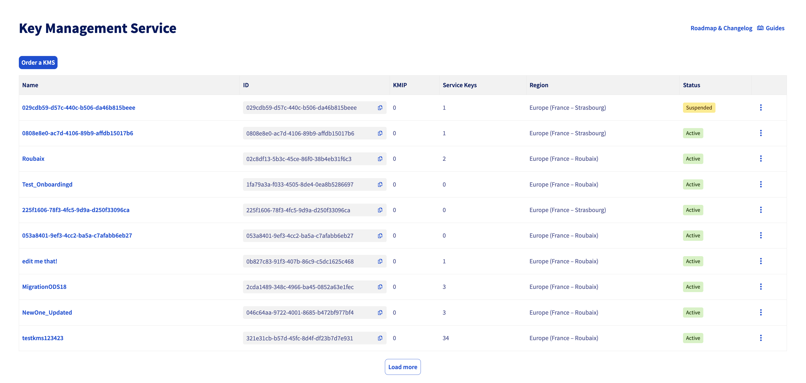
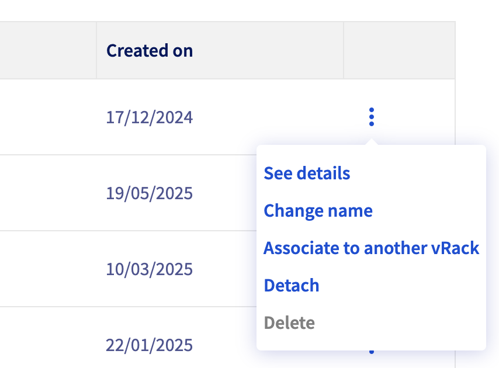
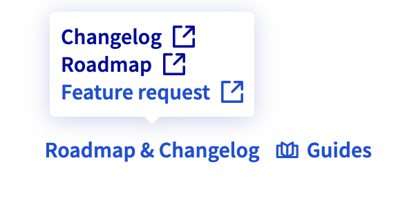
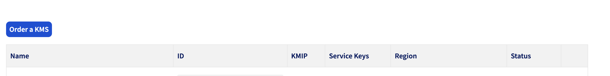

# Guideline for react templates

> 💡 Good to know
>
> **Listing, Dashboard and Onboarding templates** are already implemented in the [`generator`](https://github.com/ovh/manager/tree/master/packages/manager/core/generator) by default, you just have to modify it and update some part of the code

## How to add a Listing Page ?

The listing page is a React component that displays data in a datagrid format with filtering, sorting, and search capabilities. Here's how it's structured:



## As a developer

When you start a project, you have to choose your **main endpoint** from `APIV2` or `APIV6`.

Once the project generated, in you folder app generated, you will find `src/pages/listing/index.tsx` file.

You have a basic listing template that display all the attributes of your api response.

## Datagrid

### API CALLS

Here you can find the differents use cases for your app.

#### APIV6

- `useResourcesIcebergV6` (by default) :

  - Advanced hook for Iceberg V6 API calls
  - Data Filtering, searching, sorting features
  - Cursor mode navigation

  > ### 📌 Note
  >
  > By default the search feature is configured on the first columns of your table
  > Sorting, Searching and filtering are provided by Iceberg

```tsx

```

* `useResourcesV6`:

  - Basic hook for V6 API calls
  - Handles data fetching and state management
  - Data Filtering, searching, sorting features
  - Provides error handling and loading states
  - Cursor mode navigation

  > ### 📌 Note
  >
  > Search feature work in all your columns
  > Sorting, Searching and filtering are made in local

If you want to change, the search columns, you have to upd

#### APIV2

- `useResourcesIcebergV2`:
  - Advanced hook for Iceberg V2 API calls
  - Sorting feature

> ### ⚠️ Note
>
> If you need to aggregate data from another with V6 or V2 response, you can create a `Custom Hook`.

### TANSTACK TABLE

#### Columns Definition

For the `column definition`, you have to create a constant variable `columns`.

We recommand to create a component to display your custom data.

Here an exemple for Key Management app.

```tsx
const columns = useMemo(() => {
  return [
    {
      id: 'name',
      cell: DatagridCellName,
      label: t('key_management_service_listing_name_cell'),
    },
    {
      id: 'id',
      cell: DatagridCellId,
      label: t('key_management_service_listing_id_cell'),
    },
    {
      id: 'kmip_count',
      cell: DatagridResourceKmipCountCell,
      label: t('key_management_service_listing_kmip_cell'),
    },
    {
      id: 'action',
      cell: KmsActionMenu,
      label: '',
    },
  ];
}, []);
```
 
> ### ⚠️ Note
>
> - We recommand to use useMemo for you columns definition
> - Action columns will be always at the end of the datagrid.

#FEATURES

If you want to :

- `expend` a row, you can use the `renderSubComponent` attributes.
- `search` in columns, add `isSearchable` attribute at `true`
- `filter` in columns, add `isFilterable` attribute at `true`

#### ACTIONS



When you want to trigger action from a service, you can use `ActionMenu` component from `manager-react-components`

```tsx
import { ActionMenu } from '@ovh-ux/manager-react-components';

const Actions = () => {
  const actionItems = [
    {
      id: 1,
      onClick: () => console.info('edit'),
      urn: infoServiceUrn',
      iamActions: ['action-edit', 'getInfos'],
      label: t('modify'),
    },
    {
      id: 2,
      onClick: () => console.info('delete'),
      urn: infoServiceUrn',
      iamActions: ['action-delete', 'getInfos'],
      label: t('delete'),
    },
  ];

  return (
    <ActionMenu
      id={item.id}
      items={actionItems.filter((i) => !i.hidden)}
      variant={ODS_BUTTON_VARIANT.ghost}
      isCompact
    />
  );
}

```

You can also check IAM right if needed.

### Header button

If you need to add externals links for changelog or guides, you can use the header attributes of BaseComponent layout



Here You can find a code exemple :

```tsx
import {
  BaseLayout,
  ChangelogButton,
  GuideButton
} from '@ovh-ux/manager-react-components';

const guideItems = [
  {
    id: 1,
    href: 'https://www.ovh.com',
    target: '_blank',
    label: 'ovh.com',
  },
  {
    id: 2,
    href: 'https://help.ovhcloud.com/csm/fr-documentation?id=kb_home',
    target: '_blank',
    label: 'Guides OVH',
  },
];

return (
  <BaseLayout
    header={{
      changelogButton: <ChangelogButton links={CHANGELOG_LINKS} />,
      headerButton: <GuideButton items={guideItems} />
    }}
  >
)

```

### DEPRECATION

> ⚠️ Warning
>
> We have deprecated the `pagination` navigation.

### POLLING DATA

If you need to refresh you data, you can use a polling from `tanstack query`.

`refethInterval` is available from `useInfiniteQuery` then also in `useResourcesIcebergV6`, `useResourcesV6`and `useResourcesIcebergV2`.

```tsx
const POLLING_INTERVAL = 5000;

const {
  data,
  fetchNextPage,
  hasNextPage,
  flattenData,
  isError,
  isLoading,
  sorting,
  setSorting,
  error,
  status,
} = useResourcesIcebergV2({
  route: `${API_ENDPOINT}`,
  queryKey: [${API_QUERY_KEY}],
  refetchInterval:
});
```

## Handling errors

In case of API V6 or V2, response error for the main request, app will be display `ErrorBanner` from `manager-react-components`

...

### CTA BUTTON



The CTA button is alway at datagrid top left, you need to fill `topbar` attributes of `datagrid` component from `manager-react-components`

### Code review

- [ ] Use BaseLayout Component
- API call :
  - [ ] For V2 API call with Iceberg, use `useResourcesIcebergV2`
  - [ ] For V6 API call with Iceberg, use `useResourcesIcebergV6`
  - [ ] For V6 API call without Iceberg, use `useResourcesV6`
  - [ ] For API call with agregatted data, create a custom hook
- [ ] Create the columns definition

## Main Component

`baseLayout` component `from manager-react-components` is mainly use to display the listing page.

Here the different attributes of `baseLayout`component for the listing page :

| Attributes               | Description                                |
| ------------------------ | ------------------------------------------ |
| `Title`                  | Name application                           |
| `Headers Changelog`      | External links                             |
| `Headers Guides`         | External links                             |
| `Description (optional)` | App Description                            |
| `Message`                | services actions response (success, error) |
| `children`               | display the datagrid component from MRC    |

# Dashboard Page

The Dashboard page is a React component that provides an overview of your service's key metrics and status.

## Main Components

### BaseLayout

- Uses the same `baseLayout` component from `manager-react-components`
- Displays service overview and key metrics
- Supports custom widgets and charts

### Key Features

- **Service Status**: Display current service state
- **Metrics**: Show important KPIs and statistics
- **Quick Actions**: Common service operations
- **Resource Usage**: Display resource consumption
- **Alerts**: Show important notifications

### Implementation Recommandations Example

````tsx
// Dashboard.tsx
  return (
    <BaseLayout
      header={{
        title: t('dashboard.title'),
        description: t('dashboard.description'),
      }}
      tabs={
        <OdsTabs>
          <OdsTab is-selected="true" id="tab1">
            Informations générales
          </OdsTab>
          <OdsTab id="tab2">Tabs 2</OdsTab>
        </OdsTabs>
      }
    >
      <Outlet />
    </BaseLayout>
  );
};

# Onboarding Page

The Onboarding page is a React component that guides users through the initial setup and configuration of your service.

## Main Components

### BaseLayout

- Uses the same `baseLayout` component from `manager-react-components`
- Provides step-by-step guidance
- Supports progress tracking

### Key Features

- **Step Navigation**: Guide users through setup process
- **Progress Tracking**: Show completion status
- **Form Validation**: Ensure correct data entry
- **Help Content**: Provide contextual assistance
- **Success Confirmation**: Confirm setup completion

### Implementation Example

```tsx
<BaseLayout
  header={{
    title: t('onboarding.title'),
    description: t('onboarding.description'),
  }}
>
  <OnboardingLayout>
    <StepNavigation />
    <ProgressTracker />
    <SetupForm />
    <HelpContent />
  </OnboardingLayout>
</BaseLayout>
```

### Components

- **StepNavigation**: Guide through setup steps
- **ProgressTracker**: Show completion status
- **SetupForm**: Collect configuration data
- **HelpContent**: Provide assistance

### Best Practices

1. Keep steps simple and focused
2. Provide clear progress indicators
3. Include helpful tooltips and explanations
4. Validate input at each step
5. Allow users to save progress
6. Provide clear success/failure feedback
````
