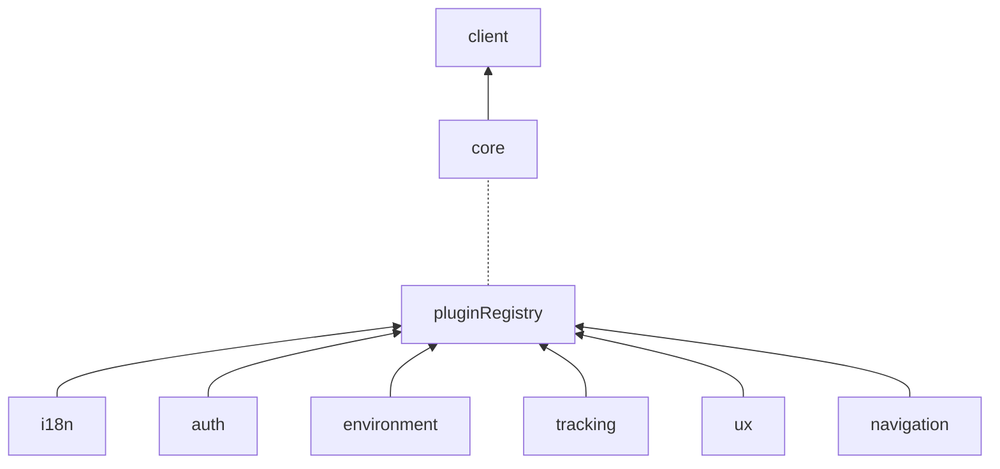

# @ovh-ux/shell

The goal of this lib is to provide utilities to communicate with a Shell. It exposes an API for that purpose, it also exposes a list of Plugins you can use with the Shell.

## Table of contents

- [@ovh-ux/shell](#ovh-uxshell)
  - [Table of contents](#table-of-contents)
  - [Usage](#usage)
  - [Philosophy](#philosophy)
  - [Architecture](#architecture)
  - [Shell initialization](#shell-initialization)
  - [Client Side API](#client-side-api)
    - [`environment`](#environment)
    - [`i18n`](#i18n)
    - [`auth`](#auth)
    - [`ux`](#ux)
    - [`tracking`](#tracking)
    - [`navigation`](#navigation)

## Usage

To use this lib, you have to add `@ovh-ux/shell` to your dependencies and then build the package under `packages/components/ovh-shell/`.

The lib is fully tree-shaked, so to import something you just have to import it as an esModule :

```ts
import { shell } from '@ovh-ux/shell';
```

## Philosophy

The philosophy behind this library, is to provide a client side API that is easy to use and where all the complicated stuff has been abstracted away. That way, you can communicate from your app to the container and the other way around without worrying about the complicated logic.

This API exposes a plugin library. Each plugin has its own methods that will be detailled below. Also bare in mind that the plugin methods exposed are all `asynchronous`, so if you want to use them synchronously you would have to call an `await` on them.

## Architecture

The code of the library is divided into two parts, the `client` part and the `core` part.
The `client` folder contains a set of plugins. Each plugin has a set of exposed methods that will after that, send the necesarry information to the container.

The `core` part is where all the logic lies, it contains all the plugins with all their methods and logic. NOT all the methods are exposed to the client. So don't forget to not mix the two.

In a nutshell, the client side is a simplified version of the core side, that is ready to use.



## Shell initialization

To init the shell, you have to import the method `useShellClient`.

```ts
import { useShellClient } from '@ovh-ux/shell';
```

By passing an app name to this method, you will have access to the shell plugins.

_Example_:

```ts
import { useShellClient } from '@ovh-ux/shell';

useShellClient('myAwesomeApp').then((shell: Shell) => {
  // Do stuff with shell
})

// You can also do this : 

const shell: Shell = await useShellClient('myAwesomeApp');

// Do stuff with shell

```

## Client Side API

### `environment`

- `getEnvironment() => Environment`: returns current environment object.
- `setUniverse(universe: string) => void`: Sets universe in the current Environnement.
- `setApplication(applicationId: ApplicationId)`: Sets current application id

_Example :_

```ts
// This example assumes you already have a shell defined

const environmentPlugin = shell.getPlugin('environment');

// Fetch locale
const env: Environment = await environmentPlugin.getEnvironment();
```

### `i18n`

- `getLocale`(`(shell: Shell, environment: Environment) => string`): Given a shell and an environment, returns the current locale of the user.
- `setLocale`(`(locale: string) => void`): Sets new user locale based on given parameter.
- `onLocaleChange`(`(callback: CallableFunction) => void`): defines a function to be triggered when the locale changes.

_Example :_

```ts
// This example assumes you already have a shell defined

const i18n = shell.getPlugin('i18n');

// Fetch locale
const oldLocale = await i18n.getLocale();

// Set locale
i18n.setLocale('en_GB');

// On local change setup
const dummyFunction = () => console.log('dummy');

i18n.onLocaleChange(dummyFunction);

// Each time the locale changes, your console will print out "dummy"
```

### `auth`

- `login()`: Login to the manager.
- `logout()`: Logout from the manager.

_Example :_

```ts
const auth = shell.getPlugin('auth');

auth.login();
auth.logout();
```

### `ux`

This plugin handles everything that is UI related, such as elements shown or hidden, the state or position of certain elements etc.
Currently, it handles the state of the account sidebar, notifications sidebar and verifies cookie verification for the ssoAuthModal.

- `showAccountSidebar() => void`) : display the account sidebar.
- `disableAccountSidebarToggle() => void`) : Disallows toggle of the Account Sidebar. After calling this function, the Account Sidebar won't toggle anymore unless you call `enableAccountSidebarToggle`.
- `enableAccountSidebarToggle() => void`) : Allows Account sidebar to be toggled.
- `isAccountSidebarVisible() => boolean`) : Returns if Account Sidebar is shown or not.
- `setForceAccountSiderBarDisplayOnLargeScreen(isForced: boolean) => void`) : forces the display on large screens. This option can be disabled by passing the false parameter to `isFalse`.
- `resetAccountSidebar() => void` : Sets the Account Sidebar to its default state.
- `isMenuSidebarVisible() => boolean` : Returns if the left Sidebar navigation menu is displayed.
- `showMenuSidebar() => void` : Shows the PNR menu.
- `onRequestClientSidebarOpen(callback: CallableFunction) => void` : adds a custom callback that will be trigerred whenever the sidebar is opened.
- `getUserIdCookie() => string`): Returns the latest value of `USER_ID` cookie.
- `getSSOAuthModalMode(oldUserID: string) => string`): Returns the mode in which the SSOAuth Modal is in. Three possible values : 'CONNECTED_TO_DISCONNECTED', 'DISCONNECTED_TO_CONNECTED', 'CONNECTED_TO_OTHER'.
  
__Preloader__ :

- `startProgress() => void` : show and start progress bar.
- `stopProgress() => void`: stop and hides progress bar.
- `hidePreloader() => void`: hides OVHcloud preloader.

_Example :_

```ts
const ux = shell.getPlugin('ux');
// Please remember that these methods are async, so you need to await for them if you want a synchronous behaviour.

ux.showAccountSidebar();
```

### `tracking`

The tracking API exposes everything that the library `ovh-at-internet` exposes with the same signature.
So basically, you can use all the functions exposed by `ovh-at-internet` the same way via this plugin.

You can check the library by clicking [this link](../ovh-at-internet/src/ovh-at-internet.ts)

_Example :_

```ts
const tracking = shell.getPlugin('tracking');
const pageData: PageData = {
  /* Your data */
};

tracking.trackPage(pageData);
```

### `navigation`

The navigation plugin allows you to navigate within the container and handles all route syncs for you. You can use to navigate to an another app or to an external link for example.

- `getURL(application: ApplicationId, path: string, params: Record<string, string | number | boolean>) => string`) : Returns a calculated URL of where you want to go.
- `navigateTo(application: ApplicationId,path: string,params: Record<string, string | number | boolean>,options: navigationOptions) => void`): Handles navigation between apps.
